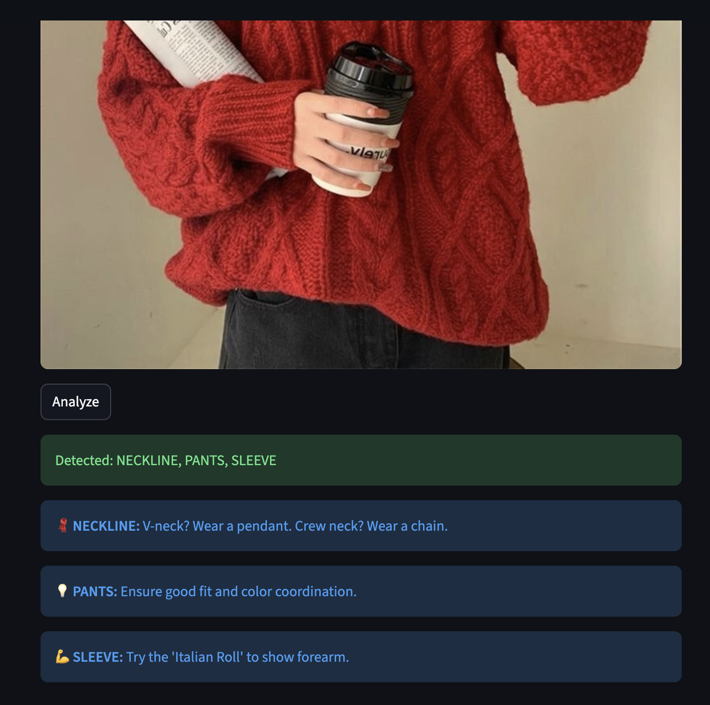

# 👗 StyleAI: Context-Aware Fashion Assistant


**StyleAI** is a computer vision application that acts as a personal stylist. Unlike standard object detectors that simply label items ("Shirt", "Pants"), StyleAI uses a **Proprietary Logic Engine** to understand fashion context, apply styling rules (like the *Sandwich Method*), and provide actionable advice.

---

## 📸 Demo


---

## 🧠 The Architecture

This project bridges the gap between **Raw Pixel Data** and **Human Styling Intuition**.

```mermaid
graph LR;
    A[User Image] -->|Input| B(YOLOS Vision Transformer);
    B -->|Detects| C{Raw Objects};
    C -->|'Sleeve', 'Neckline', 'Shoe'| D[Styling Logic Engine];
    D -->|Applies Rules| E[Algorithm: The Sandwich Rule];
    D -->|Applies Rules| F[Algorithm: 33/66 Proportion];
    E & F --> G[Final Styling Advice];
    style B fill:#f9f,stroke:#333,stroke-width:2px
    style D fill:#bbf,stroke:#333,stroke-width:2px
